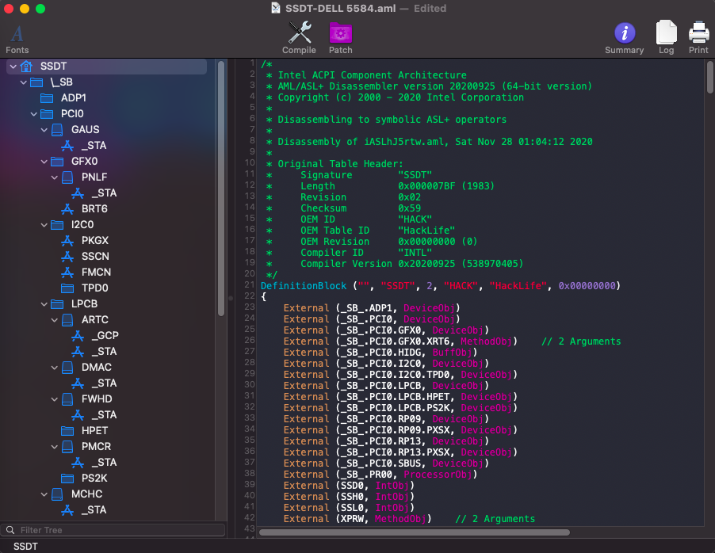

# Open Core DELL Inspiron 5584

### Computer Spec:

| Component        | Brank                              |
| ---------------- | ---------------------------------- |
| CPU              | Intel i5 8265U                     |
| iGPU             | Intel® UHD Graphics 620            |
| Display          | 1920x1080                          |
| Audio            | Realtek ALC236                     |
| Ram              | 8Gb ddr4 2400 Mhz                  |
| Wifi + Bluetooth | BCM943602BAED                      |
| NVMe             | Samsung 970 evo plus 512Gb         |
| SSD              | Kingston A400 512gb                |
| SmBios           | MacbookPro 15,2                    |
| BootLoader       | OpenCore 0.6.6                     |

  

## DPCIManager Screenshot

### What works and What doesn't or WIP:

- [x] Intel UHD 620 iGPU HDMI Output
- [x] ALC236 Internal Speakers
- [x] ALC236 Native Combojack (headphones no work)
- [x] ALC236 HDMI Audio Output
- [x] All USB Ports 
- [x] SpeedStep / Sleep / Wake
- [x] I2C Touchpad with gesture
- [x] Brightness Key
- [x] Wi-Fi and Bluetooth BCM943602BAED Module
- [x] Realtek RTL8100 LAN
- [x] USB Cardreader
- [x] ACPI Battery
- [x] NVRAM
- [x] Windows boot from OpenCore

### Special Config:

- Usb port mapping performed
- Disabled unused device
- Cosmetics DSM in Configplist

## Info Section Screenshot

## Info Section HDMI Output

## Info Section SSDT Inspiron 5584

## Update tracker

| Item | Version | Remark |
| :--- | :--- | :--- |
| MacOS | 11.0.1 | |
| [OpenCore](https://github.com/acidanthera/OpenCorePkg/releases) | 0.6.6 | Default Bootloader|
| [Lilu](https://github.com/acidanthera/Lilu/releases) | 1.5.0 | Kext/process/framework/library patcher |
| [WhateverGreen](https://github.com/acidanthera/whatevergreen/releases) | 1.4.6 | Handle Graphics card |
| [AppleALC](https://github.com/acidanthera/AppleALC/releases) | 1.5.6 | Handle/fix onboard audio |
| [CPUFriend](https://github.com/acidanthera/CPUFriend/releases) | 1.2.3 | Power management |
| [VoodooPS2Controller](https://github.com/acidanthera/VoodooPS2/releases) | 2.2.1 | Enable keyboard, alternative trackpad driver |
| [VirtualSMC + plugins](https://github.com/acidanthera/VirtualSMC/releases) | 1.2.0 | SMC chip emulation |
| [VoodooI2C](https://github.com/VoodooI2C/VoodooI2C/releases) | 2.6.3 | Intel I2C drivers |
| [Sinetek-rtsx](https://github.com/cholonam/Sinetek-rtsx) | 2.3.0 | Realtek RTSX SD Card drivers |

## Credits

- [Acidanthera](https://github.com/acidanthera) for OpenCore and all the lovely hackintosh work.
- [Apple](https://apple.com) for macOS;
- [daliansky](https://github.com/daliansky)
- [Dortiana](https://github.com/dortania)
- [Hackintoshlifeit](https://github.com/Hackintoshlifeit)
- [rehabman](https://github.com/RehabMan)

# If you need help please contact us on [Telegram](https://t.me/HackintoshLife_it) or [Web](https://www.hackintoshlife.it/)
