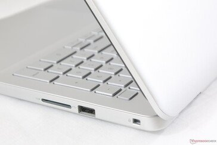
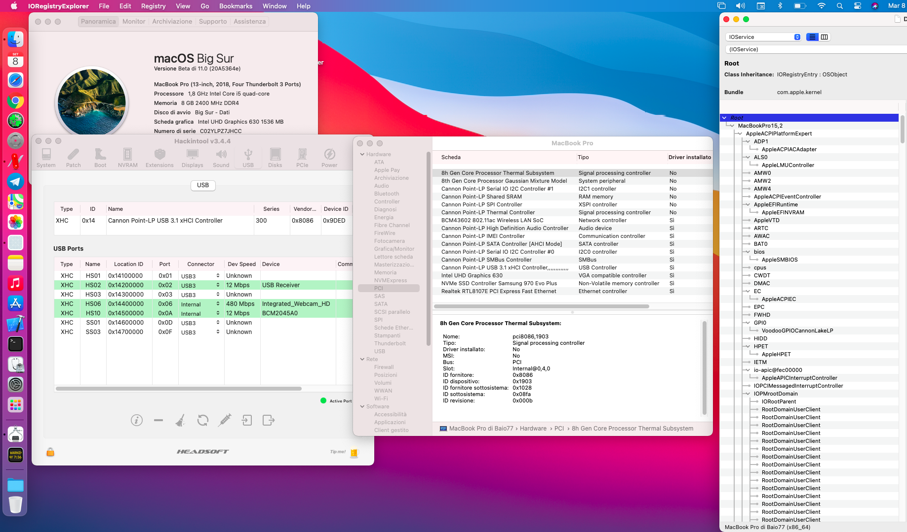

[](https://gitter.im/Hackintosh-Life-IT/community)
[](https://github.com/Baio1977?tab=repositories)
[](https://t.me/HackintoshLife_it)
[](https://www.facebook.com/hackintoshlife/)
[](https://www.instagram.com/hackintoshlife.it_official/)

# Open Core DELL Inspiron 5584

### Computer Spec:

| Component        | Brank                              |
| ---------------- | ---------------------------------- |
| CPU              | Intel i5 8265U                     |
| iGPU             | Intel® UHD Graphics 620            |
| Display          | 1920x1080                          |
| Audio            | Realtek ALC236                     |
| Ram              | 16 Gb ddr4 2400 Mhz                |
| Wifi + Bluetooth | BCM943602BAED                      |
| NVMe             | Samsung 970 evo plus 512Gb         |
| SSD              | Kingston A400 512gb                |
| SmBios           | MacbookPro 15,2                    |
| BootLoader       | OpenCore                           |


  

## DPCIManager Screenshot


### What works and What doesn't or WIP:

- [x] Intel UHD 620 iGPU HDMI Output
- [x] ALC236 Internal Speakers
- [x] ALC236 Native Combojack (headphones no work)
- [x] ALC236 HDMI Audio Output
- [x] All USB Ports 
- [x] SpeedStep / Sleep / Wake
- [x] I2C Touchpad with gesture
- [x] Brightness Key
- [x] Wi-Fi and Bluetooth BCM943602BAED Module
- [x] Realtek RTL8100 LAN
- [x] USB Cardreader
- [x] ACPI Battery
- [x] NVRAM
- [x] Windows boot from OpenCore

### Special Config:

- Usb port mapping performed
- Disabled unused device
- Cosmetics DSM in Configplist

## Info Section Screenshot



## Info Section HDMI Output


## Make Headphones works

- in OC Config.plist boot-args sectoin, add alcverbs=1

- copy alc-verb executable from AppleALC repository somewhere in your system path (preferable /usr/local/bin)

- run this command in terminal anytime to make headphones work

- alc-verb 0x19 SET_PIN_WIDGET_CONTROL 0x20

- To switch back to normal speakers from laptop
- alc-verb 0x19 SET_PIN_WIDGET_CONTROL 0x0

Note: No longer needed VerbStub.kext and CodecCommander.kext in OC/Kexts. AppleALC only needed.

- Thanks [Samnan](https://github.com/Samnan?tab=repositories)

## Info Section SSDT Inspiron 5584


## Patch Touchpad

## TouchPad and Gesture

```swift

    Scope (_SB.PCI0.I2C0)
    {
        If (_OSI ("Darwin"))
        {
            Method (PKGX, 3, Serialized)
            {
                Name (PKG, Package (0x03)
                {
                    Zero, 
                    Zero, 
                    Zero
                })
                PKG [Zero] = Arg0
                PKG [One] = Arg1
                PKG [0x02] = Arg2
                Return (PKG) /* \_SB_.PCI0.I2C0.PKGX.PKG_ */
            }
        }

        If (_OSI ("Darwin"))
        {
            Method (SSCN, 0, NotSerialized)
            {
                Return (PKGX (SSH0, SSL0, SSD0))
            }
        }

        If (_OSI ("Darwin"))
        {
            Method (FMCN, 0, NotSerialized)
            {
                Name (PKG, Package (0x03)
                {
                    0x0101, 
                    0x012C, 
                    0x62
                })
                Return (PKG) /* \_SB_.PCI0.I2C0.FMCN.PKG_ */
            }
        }
 
        Scope (TPD0)
        {
            If (_OSI ("Darwin"))
            {
                 Name (OSYS, 0x07DC)
        }
    }
}
```               
## Credits

- [Acidanthera](https://github.com/acidanthera) for OpenCore and all the lovely hackintosh work.
- [Apple](https://apple.com) for macOS;
- [Dortania](https://github.com/dortania)
- [Hackintoshlifeit](https://github.com/Hackintoshlifeit)
- [rehabman](https://github.com/RehabMan)

# If you need help please contact us on [Telegram](https://t.me/HackintoshLife_it) or [Web](https://www.hackintoshlife.it/)
